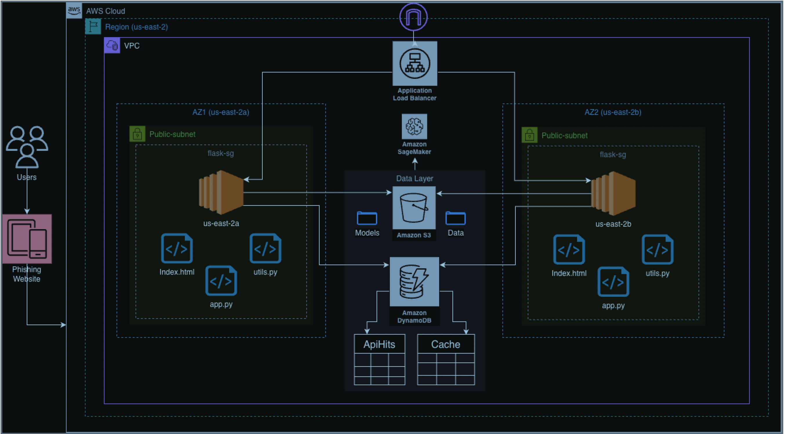

# 🛡️ **PHISHING WEBSITE DETECTION USING AWS CLOUD SERVICES**

### **Cloud Computing — DATS 6450_12**

### **Final Project — Group 5**

**Instructor:** Prof. Walcelio Melo
**Date:** December 1, 2025

---

# 📌 **Team Members**

* **Aakash Singh Sivaram**
* **Hema Chandra Puchakayala**
* **Pramod Krishnachari**

---

# 🚀 **Project Overview**

This project implements a **cloud-based phishing URL detection system** powered by:

* **AWS EC2** (Flask API hosting)
* **AWS S3** (model storage)
* **AWS DynamoDB** (caching & API logging)
* **Scikit-learn ML models** deployed using S3 model artifacts
* **Flask REST API** serving real-time predictions

Users submit a URL → API extracts features → model predicts phishing/not phishing → DynamoDB logs the request + feedback.

---

# 🧠 **How the System Works**

### **1. User sends a URL to `/predict`**

API checks if the URL prediction exists in **DynamoDB cache**:

* If cached → return instantly
* If not cached →

  * Load ML model from **S3** (cached locally after first load)
  * Extract features using `featureExtraction()`
  * Predict using Random Forest / XGBoost model
  * Save prediction in DynamoDB cache

### **2. Logging Every API Hit**

DynamoDB table `ApiHits` stores:

* request_id
* timestamp
* EC2 instance ID
* URL
* model used
* prediction
* latency
* source (`cache` or `model`)
* user feedback (optional)

### **3. User Feedback (`/feedback`)**

Saves thumbs-up/down to improve retraining pipeline.

---

# ☁️ **Cloud Architecture**

The full cloud design is shown below:



**Components Used:**

* **EC2**: Hosts Flask inference API
* **S3**: Stores ML model files under `/models/`
* **DynamoDB**:

  * `UrlPredictionCache` → Cache predictions
  * `ApiHits` → Log requests & feedback
* **IAM Roles**: EC2 ↔ S3/DynamoDB access
* **Route53 / Load Balancer** (optional depending on deployment)

---

# 🧩 **Repository Structure**

```
├── app.py
├── urlExtractor.py
├── models/
│   ├── forest_model.pkl (downloaded from S3 at runtime)
│   └── …
├── templates/
│   └── index.html
├── static/
│   └── style.css (if applicable)
├── cloud_arch.png
└── README.md
```

---

# 🖥️ **Flask Application**

The main API is implemented in **`app.py`**.

### **Key Features**

✔ Loads ML models from S3 on-demand
✔ Caches model objects in memory
✔ Caches URL predictions in DynamoDB
✔ Logs all API hits
✔ Exposes `/predict` and `/feedback`
✔ Tracks client latency
✔ Returns EC2 instance ID
✔ Retries S3 downloads for reliability

---

# 🧪 **API Endpoints**

---

## **🔹 POST `/predict`**

Run phishing classification on a URL.

### **Request**

```json
{
  "url": "http://example.com",
  "model": "forest_model.pkl"
}
```

`model` is optional → defaults to `forest_model.pkl`

### **Response**

```json
{
  "url": "http://example.com",
  "model_used": "forest_model.pkl",
  "is_phishing": false,
  "source": "model",
  "latency_ms": 42,
  "request_id": "c3af41..."
}
```

---

## **🔹 POST `/feedback`**

Store user thumbs-up/down for a request.

### **Request**

```json
{
  "request_id": "c3af41...",
  "feedback": 1
}
```

### **Response**

```json
{ "message": "Feedback saved successfully" }
```

---

# ⚙️ **Running Locally**

### **1. Install dependencies**

```bash
pip install flask boto3 joblib
```

### **2. Set AWS credentials**

(EC2 already has IAM role; local requires keys)

```bash
aws configure
```

### **3. Start the API**

```bash
python app.py
```

API runs at:

```
http://0.0.0.0:5000
```

---

# ☁️ **EC2 Deployment Instructions**

1. Launch EC2 (Amazon Linux / Ubuntu)
2. Attach IAM role with **S3 + DynamoDB read/write**
3. Install dependencies
4. Clone this repo
5. Put EC2 behind a security group allowing port `5000`
6. Run:

```bash
sudo nohup python3 app.py &
```

7. Validate API using Postman or frontend UI (`index.html`)

---

# 🔐 **AWS Resources Required**

| Service        | Purpose                          |
| -------------- | -------------------------------- |
| **S3**         | Store ML models (`models/*.pkl`) |
| **DynamoDB**   | Caching + logging                |
| **EC2**        | Host Flask backend               |
| **IAM**        | Secure access to AWS resources   |
| **CloudWatch** | (Optional) monitor EC2 logs      |

---

# 📊 **Model Loading & Caching Logic**

### **Local model cache**

```python
loaded_models = {}
```

Ensures each model loads **only once** per EC2 instance.

### **S3 download with retries**

```python
for attempt in range(1, retries + 1):
    s3.download_file(...)
```

### **DynamoDB cache**

Table: `UrlPredictionCache`

### **API Logging**

Table: `ApiHits`

---

# 🖼️ **Web Interface**

Frontend at `/` uses:

* `index.html`
* AJAX calls to `/predict` and `/feedback`

Supports:
✔ Enter URL
✔ Display phishing result
✔ Submit feedback

---

# 🏁 **Conclusion**

This project demonstrates a **scalable, cloud-native phishing detection system** using AWS services. The design ensures:

* Low latency
* High availability
* Centralized logging
* Model versioning
* Real-time feedback for iterative improvements

---

If you'd like, I can also generate a **PowerPoint presentation**, **architecture explanation slides**, or **demo script** for your class submission.
